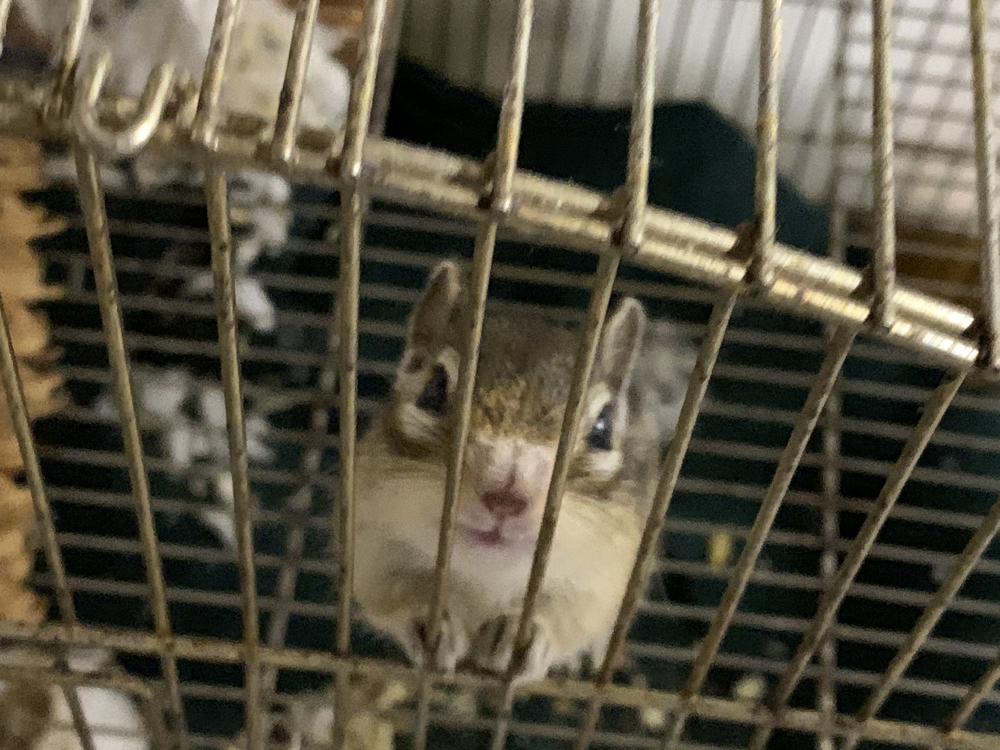

== Hello World!

test

I'm a Rails programmer and hobbyist game developer based in Fukuoka, Japan.

=== 🔗 Links
* link:https://github.com/tkmfujise[GitHub, window="_blank"]
* link:https://zenn.dev/tkmfujise[Zenn, window="_blank"]
* link:https://x.com/tkmfujise[X (Twitter), window="_blank"]
* link:https://www.youtube.com/@tkmfujise[YouTube, window="_blank"]

=== ❤️ My Favorites

==== ❤️🧩 Programming Languages
* Ruby
* Julia
* Clojure

==== ❤️🏗️ Frameworks
* Rails
* Godot

==== ❤️📝 Tools
* Helix Editor

==== ❤️📚 Books
* 吼えろペン - 島本和彦

==== ❤️🏟️ Sports
* Calcio: Inter Milano ⚫️🔵
* Horse Riding

==== ❤️🐿️ Animals
* Chipmunk: Shotaro (2010/3 - 2021/6/13)

=== 🛠️ My Works

==== 🛠️💎  Ruby Gems
* link:https://github.com/tkmfujise/i18n_factory[i18n_factory, window="_blank"]: 
Generates i18n files for each model.

==== 🛠️🎮  Godot Addons
* link:https://tkmfujise.github.io/redscribe-docs[ReDScribe, window="_blank"]:
Ruby-embedded DSL for Godot.

==== 🛠️⚛️  Julia Packages
* link:https://github.com/tkmfujise/Wakaran.jl[Wakaran.jl, window="_blank"]:
A toolkit to make Julia REPL more comfortable and expressive.

==== 🛠️🎨 Paintings
[.image-group]
--
image::images/painting-cat.jpg[Cat, 300]
image::images/painting-fox.jpg[Fox, 300]
--

